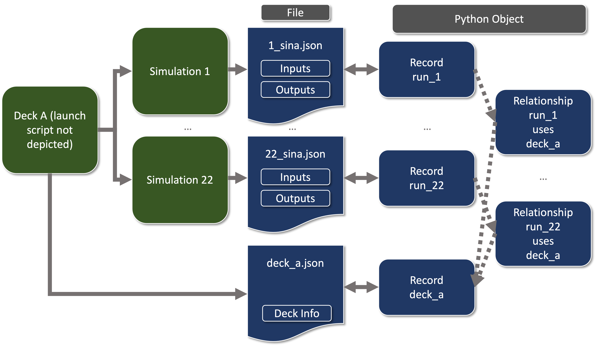

.. _api-basics:

API Concepts
============

.. note::
    This page documents Sina API concepts, essentially the "what" and "why", and
    is intended for those needing to think about Sina as a workflow component.
    You may want to check out `the examples <examples/index.html>`__
    for practical coverage, code examples, and a greater focus on the "how".

An Overview of Working with the Sina API
~~~~~~~~~~~~~~~~~~~~~~~~~~~~~~~~~~~~~~~~
The Sina API is organized around Records and Relationships. These are stored in
a DataStore to be queried en masse.

A Record typically represents something like a run, msub, or experiment (more
generally, a set of inputs and corresponding outputs and metadata), while a
Relationship represents a link between Records, such as which worker submitted which
job. Records and Relationships are Python objects, and are often stored as/read from
JSON (as a compromise between human readability and ease of automation).

Sina's API allows users to store, query, and retrieve Records and Relationships
from several backends, primarily SQLite and MariaDB, using
backend-agnostic Python to both access and modify them. The only time the user
should need to worry about the backend is during the initial setup; when using the
simplest backend, no setup is required beyond choosing a filename (if even that).
Because these backends differ greatly, but Sina "hides" these differences, we use
the more general term "DataStore".

For an example of these three things in action, let's say you launch an ensemble of runs:
simulations of a baseball impacting a certain model of bat, with the
initial velocity being varied between them. Each run is represented as a Record containing the inputs,
outputs, and any files produced--one Record is one collection of all the information
surrounding one impact between ball and bat. The ensemble itself could also have a Record
(containing shared metadata, scheduler parameters, etc), and we can use Relationships
to link an ensemble to each of its runs. If you realize you ran the ensemble in a legacy units
mode, Sina's API lets you easily find those runs, iterate through them, and update the units.
Once your runs are all complete, you
could ask the DataStore which simulation had the greatest :code:`total_baseball_distance`,
it hands you back the Record, you can easily pull the :code:`.silo` containing the mesh
of the bat, as we  stored its path as part of the workflow. This can all be
accomplished in around a dozen lines of Python, total.

Because Sina integrates with simulation codes, the hope is that all of the above can
be achieved with minimal effort on the user side; the code outputs a JSON
Record per run, which (along with any Relationships) can be handed to Sina DataStore
as part of the workflow, and all the user needs to think about is how they personally
want to interact with the data.

Of course, creating such a fluid experience requires bridging the way users
think about data and the way Sina "thinks" about data. The rest of this document
covers the latter, in hopes of making the process as easy as possible!

What a Record Is
~~~~~~~~~~~~~~~~

A Record is Sina's basic unit of info, often a collection of inputs and outputs
(ex: one run of a simulation, one analyte on a well plate). Records are useful
on their own, as they represent that info in a simple, Python-friendly
object that can be analyzed and post-processed without the hassle of
heterogenous file structures and the like.

If you use a simulation code that outputs a :code:`_sina.json` file, think of it
as the filesystem equivalent of a Record (specifically, a Record object
representing your simulation run). You can turn the json into
a Record, and dump the Record back out as the json. Of course, reading the json
into a Record doesn't intrinsically link them--that is, editing the Record object within
your Python code won't edit the file any more than opening a .pkl file and editing the object(s) within
would edit the .pkl. But once you dump that Record back to json, they're once
again in sync.

What a Record Is Used For
~~~~~~~~~~~~~~~~~~~~~~~~~

First off, you can use the aforementioned Record/json parity to post-process
simulation runs. See `the post-processing tutorial <examples/post_processing.html>`__
for an example!

Records are even more useful in aggregate. When collected together, you can use Sina to
efficiently locate Records (and thus runs of a simulation, components in a workflow, etc.) that
fulfill criteria. You can then get back that entire Record for deeper analysis--again,
no need to hassle with paths, combine data across files, etc.

A major part of this is the Record's :code:`data` field, which holds the
inputs, outputs, start times, etc. the Record's associated with. :code:`data`'s
contents can be *queried* (the criteria matching above). For example,
let's say we're interested in all Records with a
:code:`final_volume` of 310 and with a :code:`quadrant` of "NW"::

  records = ds.records.find_with_data(final_volume=310, quadrant="NW")

Of course, Records can have more than just data associated with them! Files,
families of curves, libraries (with their own data, curve sets, files, etc), as well
as the Record's :code:`type` (a short description of what the Record represents, often
something like :code:`msub` or :code:`phase_0_run`), all can be queried alone
or in concert to retrieve Records that fulfill all specified criteria over your
entire set of runs. These forms of information are also available to Sina's visualizations
and other utilities, meaning that a Record that properly characterizes your
simulation can, as you continue to fire off runs, seamlessly evolve into the
capability to analyze the entire set of runs at a go.

What a Relationships Is
~~~~~~~~~~~~~~~~~~~~~~~

Because Relationships are much simpler than Records, most of their concepts can
(and are) covered in a single dedicated tutorial, found `here <examples/relationships.html>`__

In short, Relationships are used to form links between Records, and consist of
exactly three parts: subject_id, predicate, and object_id. These work more or less as
a sentence: in "Anne knows Bob", "Anne" is the subject_id, "knows" is the predicate,
and "Bob" is the object_id. Another example is "msub_1 submits run_22".

What a Relationship Is Used For
~~~~~~~~~~~~~~~~~~~~~~~~~~~~~~~

You can use Relationships to glue together your workflow, associate iterations of
a Record, really anything where you'd want to retrieve info about some Record from another.

Relationships are key to modeling more robust workflows. For example, your workflow might
involve runs done against a few different decks. You might want to store some info about
a deck, and check that info if the deck produces an interesting run. Since that
deck is re-used (one deck, many runs), you may not want to store thousands of copies of that
same information. Having a relationship between the Record representing each run and the
Record representing the deck used (think "run_22" "uses" "deck_A") makes that easy!

Of course, Relationships are completely optional, and generally not necessary
for the most basic Sina cases (ex: you just want to store runs of a simulation
and produce some graphs about them).

What a DataStore Is
~~~~~~~~~~~~~~~~~~~
As mentioned in our discussion of Records and indicated by the existence of
Relationships, a lot of Sina's power comes from working with many Records at once.

DataStores are the key to this work. "DataStore" is Sina's generic term for a collection
of Records organized into a form Sina can work with efficiently. Basically, when you
tell Sina you want to work with a collection of Records, Sina copies
those Records into the datastore, then sorts pieces of the Records within for quick access.
This storing and sorting process is what makes the API so efficient, as well as
allowing Sina to act as an archive, fetching back the entirety of whatever Record each piece of
information came from.

The DataStore itself can be anything from a file on disk to a massive remote
database, but conceptually it's just Sina's way of organizing the
data you give it. As such, you don't need to worry about its exact form or schema.
Instead, you interact with the DataStore via a simple API that's identical regardless
of which backend is in use.

What a DataStore Is Used For
~~~~~~~~~~~~~~~~~~~~~~~~~~~~
By connecting to DataStores with Sina's API, we can access and operate on
an entire selection of Records at the same time, and do so quickly, efficiently, and
agnostic of where the data's from (whether it's biology, climate, etc).

First, we use a DataStore to define which Records we want to be available for these types
of operations. We'll dip briefly into the Sina command line here, as it's a quick way to get a
simulation run into a DataStore (:code:`somefile.sqlite` doesn't need to already exist)::

  sina ingest -d somefile.sqlite xxxx_sina.json

Now all the data found in that JSON can be accessed straight from the Python API,
no file opening or JSON parsing required! Of course, ingestion can be done through
the API as well, which can be used within a workflow to make data available right
as simulations finish (in which case no JSON is required at all).

Let's pretend we've populated that DataStore with simulation data, msubs, sruns,
and anything else we want. Now we simply connect to it::

  import sina

  ds = sina.connect("somefile.sqlite")
  all_sruns = ds.records.find(types=["srun", "msub"])

This would set :code:`all_sruns` to a generator of all the Record objects contained
in :code:`somefile.sqlite` with :code:`"type": "srun"` or :code:`"type": "msub"`.

All backends use the same JSON object model, same API (on the user side), etc,
meaning it's easy to pass data between them if you ever want to scale up
from a file on disk::

  ...

  mysql_ds=create_datastore("mysql+mysqlconnector://<connection_info>")
  mysql_ds.records.insert(all_sruns)

This would result in a MySQL database that contains all the :code:`"type": "srun"`
records found in :code:`somefile.sqlite` (assuming that :code:`sruns_only` was previously
empty). Of course, this can also be used for passing between backends of
the same type, such as creating a new sqlite file containing a subset of a
larger one, ex: all the records with :code:`"type": "run"` with a scalar "volume" greater
than 400.

This is only a small fraction of what's possible with DataStores. Be sure to check
out `the examples <examples/index.html>`__!
